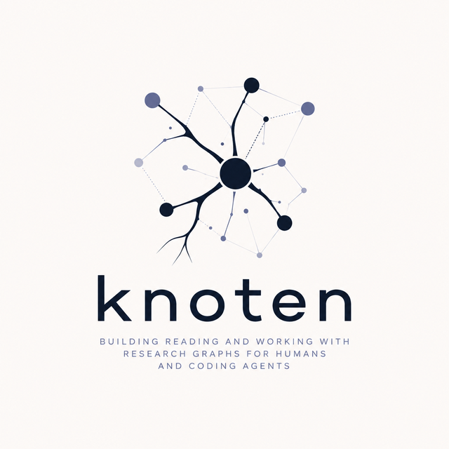

<p align="center">
  
</p>

<p align="center">
  <b>A research graph that remembers what didn't work.</b>
</p>

Each idea is a markdown file in git, marked **alive**, **dead**, or **retracted**. If it
died, the node carries the reason, what would bring it back, and the code to reproduce it.

## How it works

A graph is a folder. A node is a markdown file: **frontmatter for machines, prose for
humans, code to reproduce it.**

````markdown
---
id: hyp-self-consistency
type: hypothesis
status: dead
cause: weak_baseline
links:
  - {rel: kn:killedByGate, to: method-compute-matched-baseline}
repro:
  script: experiments/self_consistency.py
  model: Qwen3-8B-Instruct
  data: GSM8K test, 1319 questions
  cmd: python experiments/self_consistency.py --n 5 --temp 0.7
results:
  acc_greedy: 0.741
  acc_self_consistency: 0.792
  acc_compute_matched_baseline: 0.788
  tokens_per_question: 1420
  n_independent: 1319
---

# Self-consistency (sample 5, majority vote) beats greedy decoding

## Verdict: DEAD
Sampling 5 chains and taking the majority scored 79.2% vs 74.1% greedy. +5.1 points.
It looked like a free win.

## Why it died
It is not free. It costs **5x the tokens**, and given the same budget a longer-CoT
baseline reaches **78.8%**. The entire gain was compute, not method.

```python
# reproduce the kill:
python experiments/self_consistency.py --n 5 --compare compute_matched
```

## What would reopen this
A task where the majority-vote *aggregation* does real work, i.e. where the gain
survives a compute-matched baseline. Plausible for code execution or theorem proving.
GSM8K is not that task.
````

Three months later, when someone proposes self-consistency again:

```
$ knoten query "self-consistency"

  [✗ DEAD] hyp-self-consistency
      killed by : method-compute-matched-baseline
      reopen if : A task where the majority-vote aggregation does real work, i.e.
                  where the gain survives a compute-matched baseline…
```

## Use it

```bash
pip install -e .                  # the CLI is the agent surface; add ".[mcp]" only for shell-less clients

knoten init my-topic              # a new graph (it's a folder)

# deciding what to do
knoten frontier                   # what should I work on next?
knoten index                      # the whole graph, one line per node
knoten index --tag decoding       # ...narrowed to one corner of it
knoten index --since 2026-08-01   # ...or to what moved this month
knoten query <term>               # has this been tried, by keyword?
knoten show <node>                # edges, results, attachments
knoten gates                      # what must a claim survive here?

# recording what happened
knoten new hypothesis hyp-idea    # scaffold a node with whatever the rules demand
knoten commit <node> --frontmatter <f> --body <f>   # file a claim, gate-checked before it touches disk
knoten update <node> --status dead --append <f>     # move a node through its lifecycle, append to it
knoten attach <node> <file>...    # attach a script, plot or notebook
knoten detach <node> <file>

# keeping it honest
knoten validate                   # enforce this graph's own rules
knoten hook                       # make `git commit` refuse a broken graph
knoten path A B                   # how did we get from A to B?
```

Every read command above also takes `--json`; prose is the default because it's cheaper
to read (see "For coding agents" below), `--json` is there for scripts and nested data.

Each graph declares its own rules in `graph.yaml`. `knoten` knows nothing about your
field. It enforces whatever *you* said matters. The example graph requires every claim to
report `tokens_per_question` and to rest on at least 30 independent questions; a different
topic would require something else entirely.

```yaml
rules:
  - id: underpowered
    when_type: hypothesis
    require_result_min: {n_independent: 30}
    message: A result on fewer than 30 independent questions is noise, not evidence.

  - id: deaths-must-name-a-cause
    when_status: dead
    require_field_one_of:
      cause: [no_signal, cost_hurdle, weak_baseline, underpowered, crowding_decay]
    message: A cause of death you cannot filter on is a story, not an index.
```

A rule can also demand something of what an edge *points at*, not just that the edge
exists. This is the first check that outlives the moment it is written:

```yaml
  - id: methods-rest-on-live-claims
    when_type: method
    require_edge_target: {rel: prov:wasDerivedFrom, type: finding, status: alive}
    message: A method built on a dead finding is a method built on sand.
```

`validate` re-runs over the whole graph, so this is not a create-time check. The day a
finding dies, everything derived from it fails — killing one result indicts what was built
on top of it, instead of leaving it standing unchallenged. Add `min: 3` and the same key
states an inductive standard: one observation is an anecdote, not a pattern.

The mirror of that key asks what points **at** a node, which is the only way to police
work that was *abandoned* rather than written badly:

```yaml
  - id: hypotheses-must-be-tested
    when_type: hypothesis
    when_status: alive
    require_backlink: {rel: kn:testedBy, type: experiment}
    message: An untested hypothesis is not alive, it is unexamined.
```

Every other rule key starts from what the node itself declares, so they all police the
author of a claim. A hypothesis nobody ever tested declares nothing wrong — there is no
node to attach the complaint to. `require_backlink` reads the generated back-links, so the
complaint lands on the hypothesis that was left hanging.

That cause-of-death rule is what makes a dead end *reusable*. Once the cause is a field rather than
a sentence, the question you actually ask six months later is a query:

```bash
knoten index --where cause=weak_baseline    # we have a stronger baseline now — what reopens?
```

Your graph also declares its own vocabulary, and that is enforced too:

```yaml
node_types: [hypothesis, experiment, finding, method, source]
statuses:   [open, alive, dead, retracted, superseded, active]
tags:       [decoding, reasoning, prompting, evaluation, gate]
```

`type: hypthesis` is a typo, not a new type. `status: ded` is worse than wrong — it would
silently drop the claim out of every query, which is exactly the sort of quiet rot this
tool exists to prevent. Both are now violations. So is `tags: [decodng]`: tags are the
axis you filter a big graph on, so a typo'd tag leaves the node in the graph but outside
every view of it. Declare no `tags:` and tagging stays free — the core invents no
vocabulary, it only enforces the one you declared.

A rule key — or a config key — `knoten` doesn't recognise is a **hard error**, not a
shrug. Config that enforces nothing is decoration, and a rule that enforces nothing is
worse than no rule, because you think you're covered.

`knoten new` reads those rules and pre-fills exactly what they demand — nothing in the
scaffold is knoten's opinion, it's your graph's. The values are `TODO` on purpose, so
`new` + `validate` is a checklist rather than a guessing game:

```
$ knoten new hypothesis hyp-my-idea --status dead

  + nodes/hyp-my-idea.md  (hypothesis, dead)
    pre-filled what THIS graph's rules require:
      ## Why it died, ## What would reopen this, tokens_per_question, n_independent
```

The failure this tool exists to prevent was caused by **friction**, so the write path is
where friction hurts most. Write prose, not boilerplate you had to be rejected to discover.

## The gate is a git hook

```bash
knoten hook     # after `git init`
```

`git commit` now runs `knoten validate` and **refuses a graph that breaks its own rules**:

```
$ git commit -m "self-consistency is a win"

  ✗ hyp-self-consistency
      [live-claims-must-cite-their-gates] An unchallenged claim is not a finding, it is a hope.

  1 violation(s) — commit REJECTED
```

A rule that only fires when you remember to ask is the rule that let the last attempt rot.
Put it somewhere you can't walk past. (`git commit --no-verify` bypasses it — you should
have a reason.)

## Attach the code and the plots

A node isn't just a claim. It carries what you need to re-run it.

```bash
knoten attach hyp-self-consistency experiments/self_consistency.py accuracy_vs_budget.png
```

The files are copied into `attachments/<node-id>/`, listed in the frontmatter, and
images are **embedded in the node body** so they render on GitHub:

```
attachments/hyp-self-consistency/
  self_consistency.py        the script that KILLED it
  accuracy_vs_budget.png     the plot that shows why
```

`knoten validate` then fails if a node lists an attachment that isn't there. A broken
repro is a broken node.

```bash
knoten show hyp-self-consistency     # edges, results, attachments
knoten detach hyp-self-consistency accuracy_vs_budget.png
```

## What now?

A graph that only answers *"has this been tried?"* is a filing cabinet. `frontier` is the
one screen that answers *"what next?"*:

```
$ knoten frontier

  OPEN — started, never settled
    hyp-batch-schedule        Does the LR schedule interact with batch size?

  REOPENABLE — died, but said what would bring them back
    hyp-self-consistency      Self-consistency (sample 5, majority vote) beats greedy
      reopen if : A task where the majority-vote aggregation is doing real work…

  UNTESTED GATES — no claim has been through them
    method-holdout-period     Gate: hold out the last 20%
```

A dead end with a standing offer is a **cheaper experiment than a new idea**, because the
design is already written down. That is what `## What would reopen this` is for: without
somewhere to surface it, acting on one means re-reading every post-mortem in the graph.

knoten does not decide whether a condition is *met*. That is a judgement, and it is the
research. It puts the offers where you cannot walk past them.

## "Has this been tried?" — and "anything like it?"

Two different questions. `query` answers the first by keyword, ranked by how well each
node matches — partial matches surface, so a question phrased in words the node never
used still finds it:

```
$ knoten query "has anyone tried self-consistency?"

  [✗ DEAD] hyp-self-consistency
      killed by : method-compute-matched-baseline
      reopen if : A task where the majority-vote aggregation does real work…
```

But keyword search **cannot** answer the second. An idea worded differently from the node
that already killed it will not match, and a confident "no prior work found" is the one
failure of this tool that costs real work. So `index` prints the whole graph, one line per
node, and lets the reader judge:

```
$ knoten index --tag decoding

  hyp-self-consistency  ✗ DEAD  [decoding,reasoning]  Self-consistency (sample 5, majority vote) beats greedy decoding
```

That is cheap enough to read in full — the entire graph, not a guess about which part of
it is relevant. For an agent it is cheaper still than a broad `query`, because a row is a
claim rather than a whole node: on a 500-node graph a broad query returned ~83k tokens,
the same graph's index is ~9k, and one tag narrows it to ~2.5k.

## What a claim has to survive

A claim can only be marked `alive` if it cites a gate it survived. An agent that meets
the gate at commit time has already spent the compute on an experiment whose result
cannot be filed. `gates` puts the specification in front of the work:

```
$ knoten gates

  method-compute-matched-baseline  (killed 1, survived by 1)
    Gate: compute-matched baseline
    the rule : Any method that spends more inference compute must be compared against a
               baseline given the same budget — not against greedy decoding at 1x.
```

The record on the right is free — the back-links already exist — and it is the more
interesting half. A gate that has killed nothing and validated nothing has never been
applied, which is either a useless check or a check nobody is running.

## Two readers, one file

**Humans** skim the prose and get the story: what was tried, what killed it, what's
still open. No database, no UI, just markdown you can read in any editor or on GitHub.

**Agents** traverse the frontmatter: typed edges (`kn:killedByGate`, `kn:survivedGate`),
structured `results`, a `repro` block with the exact script/model/data/command, and the
paths of any attached scripts and plots, which they can read and re-run directly. An agent
answers *"has this been tried?"* and *"how do I reproduce it?"* without reading a word of
prose.

The same file serves both. That's the whole design.

## For coding agents

`SKILL.md`, at the repo root, is how an agent learns knoten — point Claude Code, or
anything else with a shell, at it. The loop is the CLI itself, and it **accumulates
knowledge about a topic across sessions** instead of starting cold every time:

```bash
knoten frontier                                                 # 1. what should I work on next?
knoten index --tag decoding                                     # 2. anything LIKE this been tried?
knoten query "self-consistency"                                 #    ...or by keyword, if it has a name
knoten show hyp-self-consistency                                # 3. the full node, post-mortem included
knoten gates                                                    # 4. what must the result survive?
knoten commit hyp-idea --frontmatter fm.yaml --body body.md     # 5. file it, pass or fail
knoten update hyp-idea --status dead --append postmortem.md     #    ...or close one opened earlier
knoten attach hyp-idea script.py plot.png                       # 6. and the code that proves it
knoten path A B                                                 # how did we get from A to B?
```

Output is prose by default — read it. `--json` exists on every read command above, for
scripts and nested data, but it costs more to read than it saves: the same 55-node graph
is ~1,185 tokens as columnar prose against ~2,551 as JSON (21 vs 46 tokens/node — 2.2x).
Reach for `--json`; don't default to it.

`--frontmatter`, `--body` and `--append` each take a file path or `-` for stdin.
`knoten update` also takes `--result key=value` (repeatable, records a result) and
`--link rel=to` (repeatable, adds an edge — e.g. the gate a claim just survived):

```bash
knoten update hyp-idea --status alive --link kn:survivedGate=method-compute-matched-baseline
```

`knoten update` appends, moves the status, and sets the fields a death is supposed to
name:

```bash
knoten update hyp-self-consistency --status dead \
  --append post-mortem.md --field cause=weak_baseline
```

`--field` sets any top-level key, including one already recorded. `--result` still refuses
to change a number the node already carries — appending to a claim is the lifecycle, and
rewriting a published result is what retraction is for.

What bounds an edit is the graph's own rules, not a list of field names: the amended node
is parsed and checked in memory, and never reaches disk if it fails. `validate` also
refuses a frontmatter `id:` that disagrees with the filename — the filename is the id, so
a node claiming otherwise lies about itself while every query still resolves it.

Exit code is the signal: `0` succeeded, `1` means refused or violated a rule. A refusal
is the feature — read the message, fix the node, run it again.

An experiment that takes a week does not finish in the session that started it. So the
agent can open a hypothesis as `open` (`knoten index --status open` shows what was
started and never finished), come back later, and close it. `knoten update` appends and
moves the status; it cannot rewrite prose or change a result that was already recorded,
and it runs the same gate `knoten commit` does — so a claim still cannot become `alive`
without citing something it survived. A correction to a claim is still a new node. Git
holds the before and after.

The agent reads the graph before running an experiment and writes back when it's done,
**including when the experiment fails.** A dead hypothesis with a documented cause of death
is the most valuable node in the graph, and the one that would otherwise be lost. It writes
back the *evidence* too: `knoten attach` puts the script it ran and the plot it made into
the node — a claim you can't re-run is a claim nobody trusts in six months.

It also tells the agent when it is about to file the same question twice. A loop running
for weeks *will* re-propose an idea it already settled, worded differently, under a new
id — so `knoten commit` reports settled claims the new node resembles, and refuses one
that records a shiny result citing no test it survived:

```json
{"status": "COMMITTED",
 "similar": [{"id": "hyp-self-consistency", "verdict": "DEAD",
              "why_it_died": "The gain was compute, not method…"}],
 "warning": "This resembles 1 settled claim. If it is the same question, supersede or
             retract that node rather than leaving two answers in the graph."}
```

```json
{"status": "REJECTED",
 "violations": [{"rule": "live-claims-must-cite-their-gates",
                 "message": "An unchallenged claim is not a finding, it is a hope."}]}
```

`ops.py` holds the one implementation behind every read — index, query, frontier, gates,
show, validate, path — as a plain function returning a dict. The CLI renders that dict as
prose or dumps it with `--json`; `commit` and `update` are shared functions too. There is
one behavior to keep correct, not two that can drift apart.

### Clients without a shell (MCP)

Not every agent has Bash. For a chat UI wired to MCP servers rather than a coding agent,
the graph is still reachable — just at a price the CLI doesn't pay: MCP loads ~2,340
tokens of tool schema and instructions into every session whether the agent touches the
graph or not (1,928 of schema + 412 of instructions), where `knoten --help` costs ~304,
and only when asked. Use the CLI and `SKILL.md` above if the client can run one.

```bash
pip install -e ".[mcp]"      # needs mcp 2.x
```

```jsonc
{"mcpServers": {"knoten": {
  "command": "knoten-mcp",
  "env": {"KNOTEN_GRAPH": "/path/to/llm-research"}
}}}
```

```
knoten_frontier()                                    ← 1. what should I work on next?
knoten_index(tags=["decoding"])                      ← 2. has anything LIKE this been tried?
knoten_query("self-consistency")                     ←    ...or by keyword, if it has a name
knoten_get("hyp-self-consistency")                   ← 3. the full node, post-mortem included
knoten_gates()                                       ← 4. what must the result survive?
knoten_commit(node)                                  ← 5. file it, pass or fail
knoten_update(node, status="dead", append=…)         ←    ...or close one opened earlier
knoten_attach(node, [script, plot])                  ← 6. and the code that proves it
knoten_path(a, b)                                    ← how did we get from A to B?
knoten_validate()                                    ← run the graph's own rules
```

The server hands that order to the client at connect time as its `instructions`, so the
agent is told how the loop fits together once, rather than guessing it from ten tool
descriptions. Every tool here is a thin wrapper over the same `ops` / `commit` / `update`
functions the CLI calls — same gates, same refusals, same JSON shown above, just
serialised as a tool result instead of printed as prose.

## Why bother

**You stop redoing experiments you already ran and forgot.** Dead ends come back with
their cause of death and a command to re-run them.

**And work that outlives the session still gets closed.** An agent opens a hypothesis,
runs an experiment for a week, and records the verdict on the same node when it returns —
so *what is still open?* stays a real answer instead of filling up with questions that
were settled and never filed.

**And you can't fool yourself as easily:** a claim can only be marked *alive* if it cites
a test it survived, so a good-looking result that was never checked can't quietly become
a finding.

**And a broken node is a loud failure, not a quiet one.** Unreadable frontmatter, an
unknown edge relation (`kn:killdByGate` — one letter dropped), a rule key that doesn't
exist: all are errors. A graph that silently drops what it can't parse reports itself
healthy while it rots.

**And a claim someone later withdrew says so.** `query` surfaces the retraction from both
sides, so an agent asking *"has this been tried?"* about a claim that was later retracted
is told it was retracted — not just what the claim said:

```
  [✓ ALIVE] hyp-few-shot-format
      survived     : method-compute-matched-baseline
      RETRACTED by : ret-oops
```

See `examples/llm-research/` for a worked graph and [SPEC.md](SPEC.md) for the design.

MIT. One runtime dependency: PyYAML. The MCP fallback additionally needs the `mcp` SDK
(2.x — `pip install -U 'knoten[mcp]'` if you are coming from an older knoten). No
framework, no database, no build step: a handful of small modules you can read in one
sitting.
