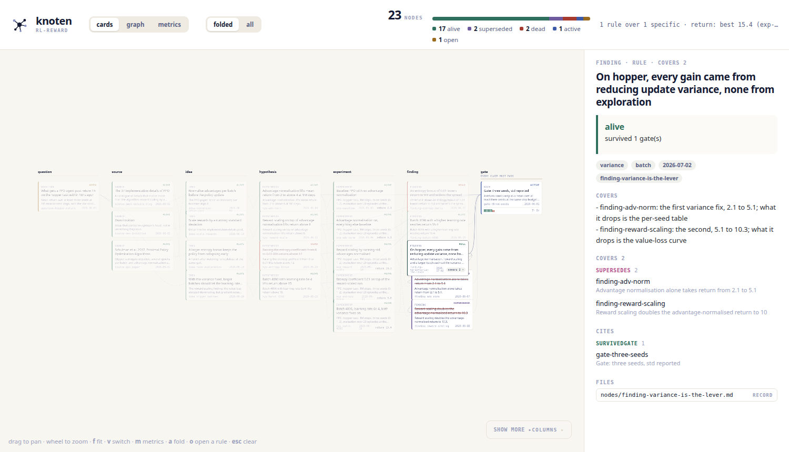
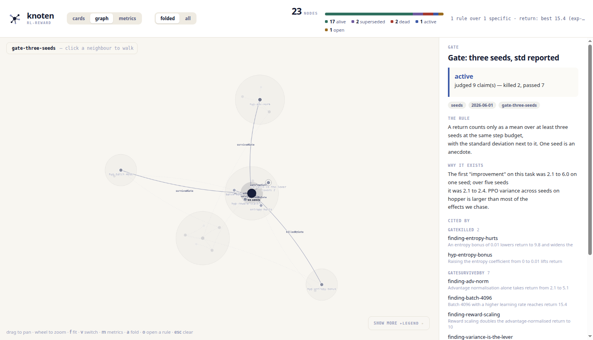
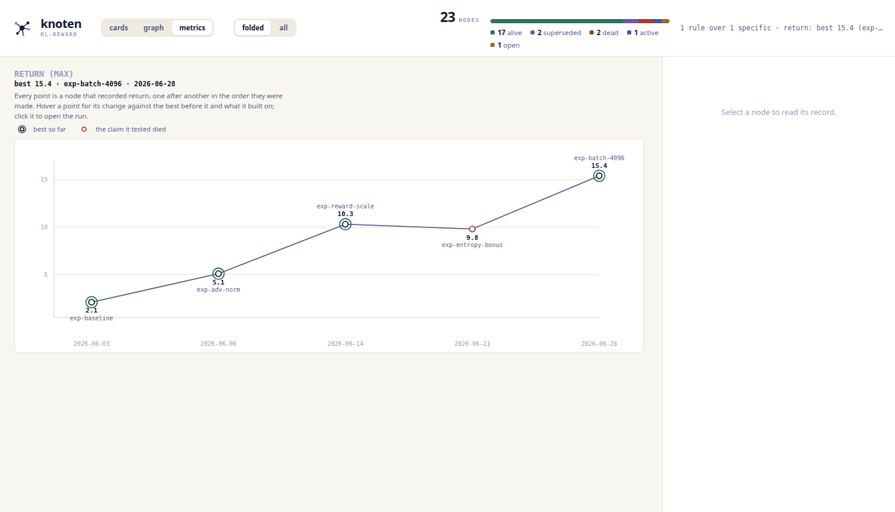

<p align="center">
  
</p>

<p align="center">
  <b>A research graph that remembers what didn't work.</b>
</p>

- **One shared graph for a team.** Host it with `knoten serve`, invite people with read or
  write rights, and every push is checked against the graph's own rules and a signed
  identity that lives in the graph, not on the server.
- **Dead ends are the asset.** A dead hypothesis carries why it died, what would bring it
  back, and the script that killed it. Nothing is deleted; a correction is a new node.
- **Rules are data.** Your `graph.yaml` says what a claim must carry and what it must
  survive; the tool enforces it and knows nothing else about your field.
- **It gets wiser, not just bigger.** Several findings that say the same thing become one
  general finding that supersedes them, held to every check they passed.
- **Track the number you are trying to move**, from the results your experiments already
  record, with what each run built on.
- **Agents run it before the work.** `knoten frontier` says what to do next, `knoten index`
  whether it was tried in other words, `knoten gates` what a result must survive.
- **A visualizer you can hand to anyone.** `knoten viz` writes one HTML file: the graph as
  cards, as a map, and as your metric over time, with every record one click away.
- **Zero dependencies.** Markdown files in git and PyYAML. No database, no build step, no
  server until you share.

<details>
<summary><b>Visualizer</b>: the same graph as cards, as a map, and as a metric over time (click a picture to enlarge)</summary>
<br>
<table>
<tr>
<td align="center" width="33%"><a href="assets/viz-cards.png"></a></td>
<td align="center" width="33%"><a href="assets/viz-graph.png"></a></td>
<td align="center" width="33%"><a href="assets/viz-metrics.png"></a></td>
</tr>
<tr>
<td valign="top"><b>Cards</b>, one column per stage of the loop. A general finding carries <code>covers 2</code>; open it and the two findings it retired hang beneath it, and its record says what each contributed, which gate it survived, and where its file is.</td>
<td valign="top"><b>Graph</b>, clustered around the busiest nodes. Here the gate is selected: its rule, why it exists, and the nine claims it judged, two of them killed.</td>
<td valign="top"><b>Metric over time.</b> Each point is a run that recorded <code>return</code>, in the order the runs were made; the ring marks the best so far, the red point a run whose claim died, and hovering a point says what it built on.</td>
</tr>
</table>

One self-contained HTML file, written by <code>knoten viz</code>, that anyone can open without installing anything.

</details>

## A node

````markdown
---
id: hyp-self-consistency
type: hypothesis
status: dead
cause: weak_baseline
links:
  - {rel: kn:killedByGate, to: gate-compute-matched-baseline}
repro:
  script: experiments/self_consistency.py
  model: Qwen3-8B-Instruct
  data: GSM8K test, 1319 questions
  cmd: python experiments/self_consistency.py --n 5 --temp 0.7
results:
  acc_greedy: 0.741
  acc_self_consistency: 0.792
  acc_compute_matched_baseline: 0.788
  tokens_per_question: 1420
  n_independent: 1319
---

# Self-consistency (sample 5, majority vote) beats greedy decoding

## Verdict: DEAD
Sampling 5 chains and taking the majority scored 79.2% vs 74.1% greedy. +5.1 points.
It looked like a free win.

## Why it died
It is not free. It costs **5x the tokens**, and given the same budget a longer-CoT
baseline reaches **78.8%**. The entire gain was compute, not method.

```python
# reproduce the kill:
python experiments/self_consistency.py --n 5 --compare compute_matched
```

## What would reopen this
A task where the majority-vote *aggregation* does real work, i.e. where the gain
survives a compute-matched baseline. Plausible for code execution or theorem proving.
GSM8K is not that task.
````

<details>
<summary><b>The loop</b></summary>

```bash
pip install git+https://github.com/BY571/knoten
knoten init my-topic          # a graph is a folder

knoten frontier               # what should I work on next?
knoten index --tag decoding   # anything LIKE this been tried?
knoten gates                  # what must a claim survive here?
knoten new hypothesis hyp-x   # scaffolded from this graph's rules
knoten commit hyp-x --frontmatter fm --body b   # checked before it touches disk
knoten update hyp-x --status dead --append post-mortem.md --field cause=weak_baseline
knoten attach hyp-x run.py accuracy.png
knoten viz --open             # the whole graph as one HTML file
```

A round goes source, idea, hypothesis, experiment, finding; a scaffolded graph refuses a
step that skips the one before it. Every read command takes `--json`. Exit `0` succeeded,
`1` refused, and a refusal is the feature: read it, fix the node, run it again.

</details>

<details>
<summary><b>Rules are data</b></summary>

```yaml
rules:
  - id: deaths-must-name-a-cause
    when_status: dead
    require_field_one_of:
      cause: [no_signal, cost_hurdle, weak_baseline, underpowered, crowding_decay]
    message: A cause of death you cannot filter on is a story, not an index.
```

Once the cause is a field rather than a sentence, six months later it is a query:
`knoten index --where cause=weak_baseline`. Your graph declares its node types, statuses
and tags the same way, and a typo is a violation, not a new type. A `gate` is a check a
result should survive; by default an alive claim that cites none is listed by
`knoten frontier` as unchecked, not refused, and one commented rule makes it mandatory.

</details>

<details>
<summary><b>Track your research metric</b></summary>

```yaml
metrics:
  return: {goal: max}
```

`knoten metric return` reads the `results:` your experiments already carry, along the
time axis, each against the best before it, with what it built on:

```
  return (max)   best 15.4  exp-batch-4096  2026-06-28
    2026-06-03  exp-baseline                     2.1   baseline  ★
    2026-06-06  exp-adv-norm                     5.1         +3  ★
    2026-06-14  exp-reward-scale                10.3       +5.2  ★
    2026-06-21  exp-entropy-bonus                9.8       -0.5
    2026-06-28  exp-batch-4096                  15.4       +5.1  ★  builds on exp-reward-scale
```

</details>

<details>
<summary><b>Compress</b></summary>

When several findings under one question say the same thing, write the statement that
makes them unnecessary and point it at each of them:

````markdown
---
id: finding-sc-needs-scale
type: finding
status: alive
tags: [decoding]
created: 2026-09-06
links:
  - {rel: npx:supersedes, to: finding-sc-small-models}
  - {rel: npx:supersedes, to: finding-sc-large-models}
  - {rel: kn:survivedGate, to: gate-compute-matched-baseline}
---

# Self-consistency pays only above a size the budget can afford

Compute-matched, sampling more chains buys nothing below ~7B and about two points above it.

## Covers
- finding-sc-small-models: the within-noise result; what it drops is the per-size table
- finding-sc-large-models: the two-point gain; what it drops is the exact token count
````

The general node must face every gate its specifics faced and name each of them in
`## Covers`; they flip to `superseded` in the same commit and `knoten index` stops listing
them. `knoten frontier` opens with the shape of the graph and lists `COMPRESSIBLE`
clusters (three or more alive findings sharing a gate or a tag). The commit says what it
bought:

```
  + nodes/finding-sc-needs-scale.md  (8 nodes)

  ! This resembles 2 settled claim(s). If it is the same question, supersede or retract that node (npx:supersedes / npx:retracts) rather than leaving two answers in the graph.
    exp-self-consistency-budget  [✓ ALIVE]  Self-consistency against a compute-matched baseline, at three model sizes
    hyp-self-consistency  [✗ DEAD]  Self-consistency (sample 5, majority vote) beats greedy decoding
    compressed 2 findings into 1 under question-what-improves-reasoning
    survived the 1 gate they faced
    this graph now stands on 1 rule and 0 specifics
```

</details>

<details>
<summary><b>A shared graph</b></summary>

A remote is a `knoten serve` process on any machine you reach over HTTPS. Who may write
is written in the graph itself (`contributors.yaml`, signed commits), not on the server.

```bash
knoten serve --data ~/knoten-remotes                 # on a box behind TLS; prints the owner secret once
knoten remote create trading --on https://graphs.example --as seb
knoten invite maria --role write                     # a one-time code; send it to her

knoten join https://graphs.example/trading --invite 7f3a9c...   # maria, once
knoten pull                                          # every session: what arrived
knoten commit ...; git add -A && git commit -m "hyp-14: ..."; knoten push
knoten revoke maria                                  # seb, whenever
```

`knoten commit` files a node; git commits it; `knoten push` sends it through the gate,
which runs the graph's rules and checks the signature for everyone. `knoten pull`
replays your commits on top of what arrived; a hosted graph is one line of history. A
revoked person keeps their clone; only their token and future signatures stop working.

</details>

## For agents

[`SKILL.md`](SKILL.md) teaches the loop; [`src/knoten/prompts/`](src/knoten/prompts)
says how to write each kind of node, and where to look when there are no ideas left.
[`examples/rl-reward/`](examples/rl-reward) is the graph in the screenshots (a return
climbing 2 to 15 over five experiments); [`examples/llm-research/`](examples/llm-research)
a second one; [SPEC.md](SPEC.md) the design.

MIT. One dependency: PyYAML. No framework, no database, no build step, and no server until
you share a graph.
