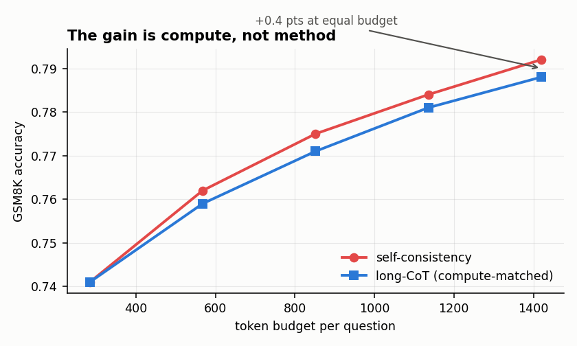

# Self-consistency (sample 5, majority vote) beats greedy decoding

## Verdict — DEAD

Sampling 5 chains at temp 0.7 and taking the majority answer scored **79.2%** on GSM8K
vs **74.1%** greedy. A +5.1 point gain. It looked like a free win.

## Why it died

It is not free — it costs **5x the tokens**. Given the same budget, a simple
longer-CoT baseline reaches **78.8%**.

The entire gain was compute, not method. +0.4 points for 5x the bill is not a
technique, it is a rounding error with a marketing department.

The script that kills it is attached to this node:

```bash
python attachments/hyp-self-consistency/self_consistency.py --n 5 --compare matched
```

## What would reopen this

A task where the majority-vote *aggregation* is doing real work — i.e. where the gain
survives a compute-matched baseline. Plausible for tasks with a verifiable answer and
high variance across chains (code execution, theorem proving). GSM8K is not that task.

## Attachments


